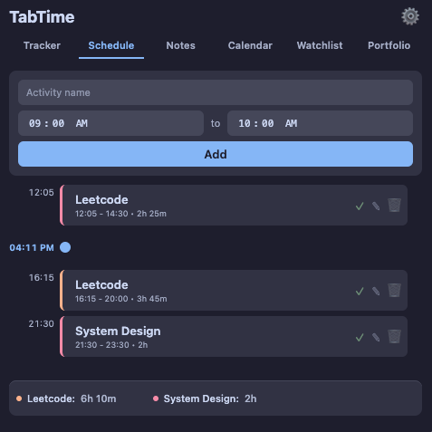
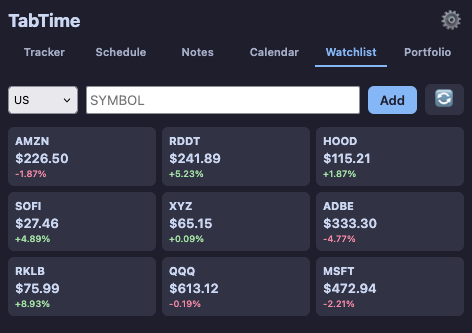
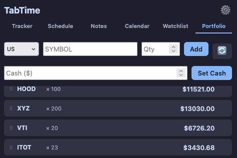
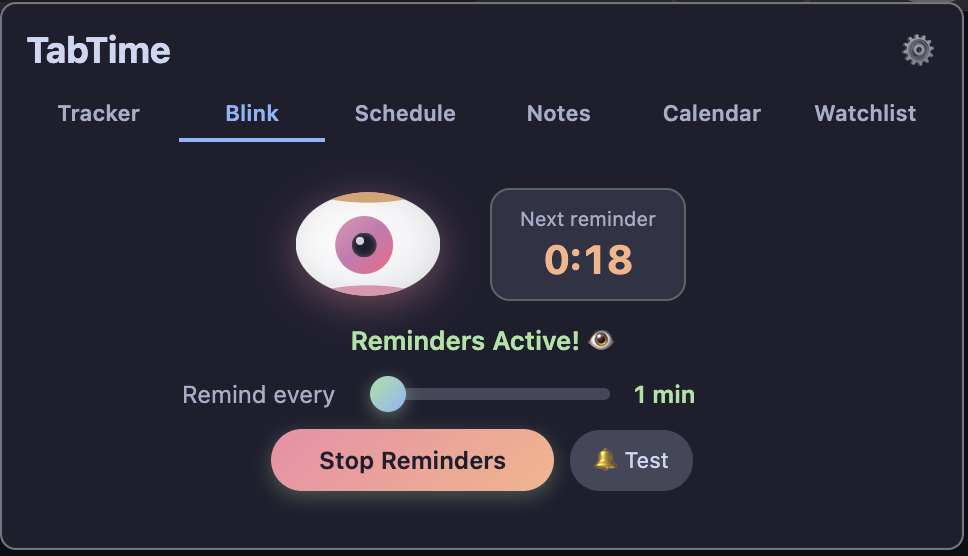
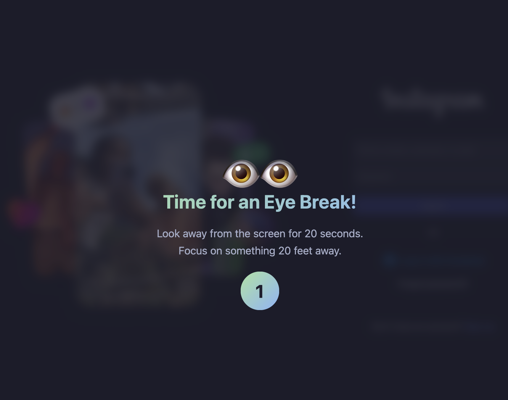

# Webtime Tracker

A Firefox extension for tracking time spent on websites, managing timers, taking notes, and organizing your daily schedule.

## Screenshots

| Tracker | Schedule | Notes |
|---------|----------|-------|
|  |  |  |

| Calendar | Watchlist | Portfolio |
|----------|-----------|-----------|
|  |  |  |

| Blink Eyes Tab | Blink Eyes Overlay |
|----------------|--------------------|
|  |  |

## Features

### 🕐 Time Tracking
- Automatically tracks time spent on each website
- Groups subdomains together (e.g., mail.google.com, docs.google.com → google.com)
- View stats by Today, Week, or All Time
- Visual donut chart showing time distribution

### ⏱ Timer
- Quick timers with presets (5m, 15m, 25m)
- Custom timer input (e.g., "25m", "1h 30m")
- Desktop notifications when timer completes
- Multiple simultaneous timers supported

### 👁️ Blink Eye Reminder
- Reminds you to rest your eyes and reduce eye strain
- Configurable intervals from 1 to 60 minutes (default: 20 minutes)
- Based on the 20-20-20 rule: every 20 minutes, look at something 20 feet away for 20 seconds
- Visual countdown timer showing time until next reminder
- Progressive urgency indicator - the eye turns red as the reminder approaches
- Beautiful full-screen overlay notification that auto-dismisses
- Works on any webpage without requiring notification permissions

### 📅 Schedule
- Plan your day with time-blocked activities
- Smart color coding for similar activities
- Schedule timers to auto-start at activity time
- Time summary showing total hours per activity

### 📝 Notes
- Daily notes with rich text formatting (bold, italic, strikethrough, lists)
- Save important notes for later
- Auto-saves as you type
- Export notes to file

### 📆 Calendar
- View your activity history by date
- See notes and stats for any day

### 📈 Watchlist & Portfolio
- Track stock prices
- Manage your investment portfolio
- Drag-and-drop reordering

## Installation

### From Firefox Add-ons (Recommended)
*Coming soon*

### Manual Installation (Developer Mode)
1. Clone this repository:
   ```bash
   git clone https://github.com/aadityc91/webtime-tracker.git
   ```

2. Open Firefox and navigate to `about:debugging`

3. Click "This Firefox" in the sidebar

4. Click "Load Temporary Add-on"

5. Select the `manifest.json` file from the cloned repository

## Usage

1. Click the extension icon in your toolbar
2. Navigate between tabs: Tracker, Schedule, Notes, Calendar, Watchlist, Portfolio
3. The extension automatically tracks time on websites
4. Use the Schedule tab to plan your day and set timers

## Privacy

This extension:
- Stores all data locally in your browser
- Does not send any data to external servers
- Does not require any account or login
- Only tracks time on websites you visit (stored locally)

## Permissions

- `tabs`: To track which website you're viewing
- `storage`: To save your data locally
- `alarms`: For timer functionality
- `notifications`: To alert you when timers complete

## Development

### Project Structure
```
webtime-tracker/
├── manifest.json        # Extension manifest
├── background/
│   └── background.js    # Background script for tracking & alarms
├── popup/
│   ├── popup.html       # Main UI
│   ├── popup.js         # UI logic
│   ├── style.css        # Main styling
│   ├── blinkeyes.js     # Blink eyes reminder logic
│   └── blinkeyes.css    # Blink eyes tab styling
├── content/
│   ├── overlay.js       # Content script for timer & blink eyes overlays
│   └── overlay.css      # Overlay styling
└── icons/               # Extension icons
```

### Building & Release

To package the extension for both Chrome and Firefox:

1. Run the build script:
   ```bash
   ./build.sh
   ```

2. This creates a `dist` folder containing:
   - `chrome-extension.zip` - Ready for Chrome Web Store
   - `firefox-extension.zip` - Ready for Firefox Add-ons
   - `chrome/` and `firefox/` - Unpacked folders for testing

The project uses separate manifest files for cross-browser compatibility:
- `manifest-chrome.json` (Service Worker)
- `manifest-firefox.json` (Background Scripts)

## License

MIT License - see [LICENSE](LICENSE) file for details.

## Contributing

Contributions are welcome! Please feel free to submit a Pull Request.
